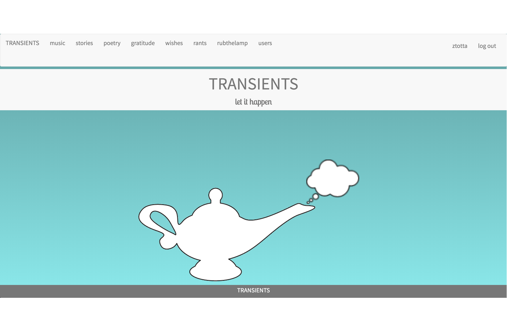
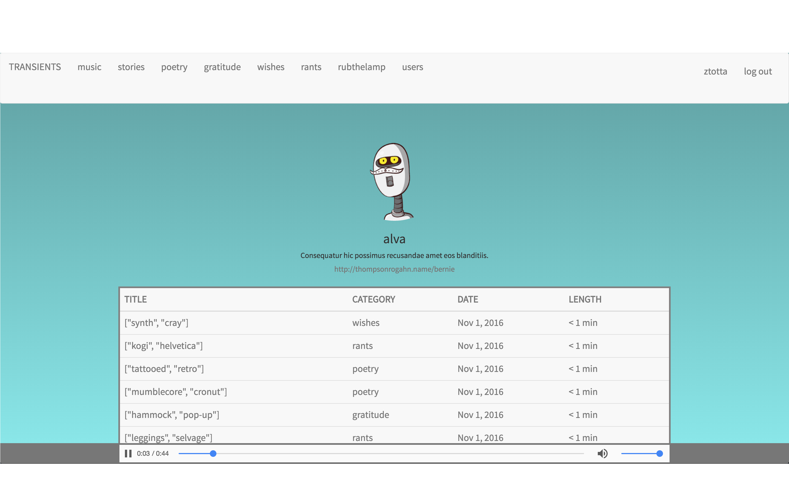

 
#[TRANSIENTS](https://www.transientsapp.com)

###Bringing scarcity back to audio

#####[www.TransientsApp.com](https://www.transientsapp.com)
##### a Ruby on Rails App
#####by [Zach Totta](https://www.linkedin.com/in/zachary-totta-8aa21627)

--

--

###Site philosophy:

In reflecting on the ubiquity of music in a digital age, I feel that audio is simply too accessible and thus too easy to take for granted. With Transients, my hope is to help users form healthy relationships between the fleeting nature of live art and the beauty of the Internet's promise of global connnectedness, infinitely reproducible audio files, and instant access.

--

###Description:

Users can upload audio in 1 of 6 categories: music, stories, poetry, gratitude, wishes, and rants.
Users can then listen to others' uploads...but only once. As soon as the audio begins to play, the track disappears and becomes inaccessible forever, encouraging the user to 1) only listen when they are truly ready and 2) be present in that moment, as it's their only opportunity to do so.

I believe that this could be a refreshing and powerful tool for artists to connect to their fans with, as it does away with the addictive tallying of "likes" and "plays" and instead encourages authenticity, organic production quality, and openness to hearing what others have to say, regardless of their popularity.

The rub-the-lamp function takes a willing user to a random track from the database and lays it out for them to experience. 

Below is a user profile page. I wanted to keep the site inviting but simple, as it's meant as a vessle for audio at the end of the day.

--

  

--

###Technologies used:
This is a full-stack Ruby on Rails application that utilizes HTML, JavaScript, jQuery / AJAX, PostgresQL, CSS, Bootstrap, Paperclip, bCrypt, [Agile Development](https://trello.com/b/Y7iZEk7U/transients), and AWS S3 file hosting. It's deployed via Heroku. 

--

###Code
The most challenging feature to code was the removal of each user's access to the tracks that they had already listened to without limiting other users' access. This was achieved by creating a join table between the users and the tracks they listened to. After listening, the track was removed from the page via jQuery and the track id was pushed to this table in the database via Ajax. When a new page would load, any tracks with ids matching those on the join table would be skipped over and thus not be printed onto the screen for the user to access. 

The biggest challenge here was concealing the previously heard tracks from the current user. I achieved this by creating a join-table between the tracks and the users and checking for matches before displaying tracks.

--

###Yet to be resolved:
As this was my first full-stack app, and it was dreamt, designed, and built in 1 week, it is still incomplete.

Eventually I would like to implement a followers/following system so that users could keep tabs on artists/friends they enjoy listening to and be alerted when a new track is available, though there would still be no visible tally. I would also like to make a "tag" system and the ability to search for tags and users. At the highest priority, I want users to be able to record audio directly from the app's interface, rather than relying on uploading files. Finally, I believe a direct-messaging component would round this app out into a viable, complete app that's fun and easy to use.

As of now, when a user visits their profile page, they have to refresh before the "edit profile" and "upload track" modals will function properly, and the audio player is very vanilla-looking. If a user clicks on a second track or changes pages before the first track's audio has finished, multiple files will play simultaneously. This is a matter of reconfiguring the dance between removing the audio player's previous file, loading the new track's audio into the player, launching that track, and ensuring the auto-playing audio player is removed upon navigating to a new page. Also, the controller actions could be DRY'd up significantly.

Finally, the logo is sloppy and I didn't get around to designing it fully in all of its iterations. Eventually, the poetry section will have the thought bubbles coming out of the lamp, the music will have notes, the stories will be a speech bubble, the rants will be exclamation marks, etc.

--
###Conclusion:
Overall, I'm quite happy with the site and I'm proud of how much I had to devise and learn in order to even get it to where it is at this moment. Through all of the slogging, I feel much more comfortable with Ruby on Rails and the distinction/connection between the back and front ends. Working independetly on a full-stack app feels like being both the chef and the waiter, jumping between building the foundation/connecting all the wires and presenting the result to the human eye. It's been intimidating and at times overwhelming, but confronting and overcoming such challenges in the name of creation is how I learn best.
